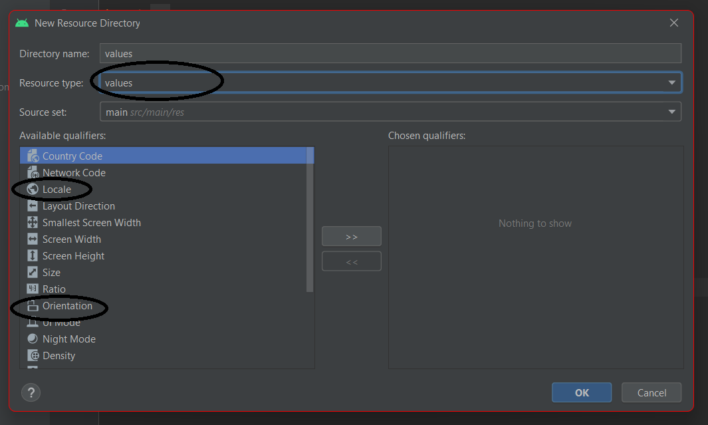

1.  В класі View є всі константи які можуть знадобитись для різних атрибутів. 
    
2.  Створення локалізацій та екранів різної орієнтації (orientation):




3. Невидимий елемент:
```kotlin
viewBinding.textView.visibility=View.GONE
```
(Можливі віранти VISIBLE i INVISIBLE)

4. Бібліотеки для картинок:  Picasso, Glide, Fresco
5. Функція яка створює вспливаючі повідомлення які вспливають, випригують наче тост: 

Toast.makeText(this, "TEST TEST", LENGTH_LONG).show() 

Треба використовувати при натисканні на кнопку чи при якомусь івенті