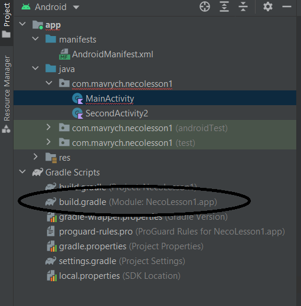

В GradleScrips в файл build.gradle


В розділ android додати:
```kotlin
buildFeatures{ 
    viewBinding true 
}
```

Тепер в Котлін коді можна отримати посилання на весь XML  (наприклад: activity_main.xml) через код:

```kotlin
class MainActivity : AppCompatActivity() { 

    lateinit var viewBinding : ActivityMainBinding 

    override fun onCreate(savedInstanceState: Bundle?) { 

        super.onCreate(savedInstanceState) 

        viewBinding = ActivityMainBinding.inflate(layoutInflater) 

        setContentView(viewBinding.root) 

    } 

}
```