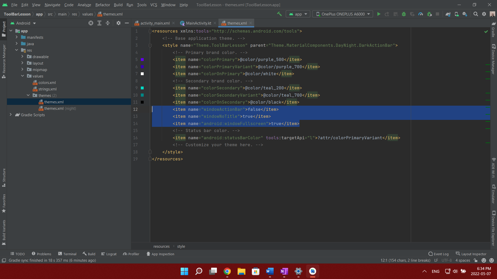

1.  Відключення toolbar  та повний екран  для додатку то треба в theme xml прописати наступне: 
```kotlin
<item name="windowActionBar">false</item> 
<item name="windowNoTitle">true</item> 
<item name="android:windowFullscreen">true</item>
```

2. Додати стрілку (arrow)  в Toolbar. В onCreate додати : 
```kotlin
supportActionBar?.setDisplayHomeAsUpEnabled(true) 
```

Та переоприділити функцію: 
```kotlin
override fun onOptionsItemSelected(item: MenuItem): Boolean { 

    if(item.itemId == android.R.id.home){ 

        finish() 

    } 

    return true 

} 
```
 ( у самої кнопки назад id наступний android.R.id.home