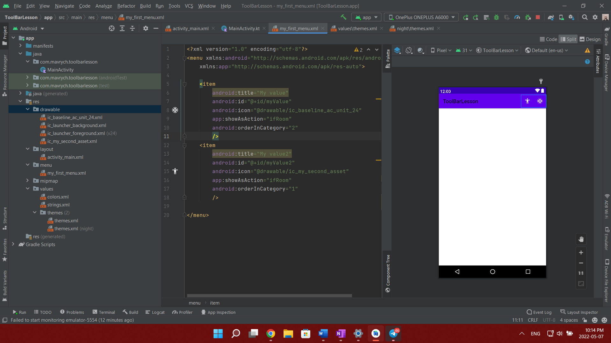

1.  Відключення toolbar  та повний екран  для додатку то треба в theme xml прописати наступне: 
```kotlin
<item name="windowActionBar">false</item> 
<item name="windowNoTitle">true</item> 
<item name="android:windowFullscreen">true</item>
```

2. Додати стрілку (arrow)  в Toolbar. В onCreate додати : 
```kotlin
supportActionBar?.setDisplayHomeAsUpEnabled(true) 
```

Та переоприділити функцію: 
```kotlin
override fun onOptionsItemSelected(item: MenuItem): Boolean { 
    if(item.itemId == android.R.id.home){ 
        finish() 
    } 
    return true 
} 
```
 ( у самої кнопки назад id наступний:  android.R.id.home )
 
 3.  Також можна змінити title (назву): 
```kotlin
supportActionBar.title = "Some Title"
```
4. Додати своє меню. Треба створити нову директорію menu в директорії res

А потім в цій дирокторії створити xml файл:

5. Для створення іконки створити в drawable Vector Asset:

6. Головні атрибути зображені на скріні. Серед них: title, id, icon, стиль відображення,  порядковий номер :

7. Далі в Activity необхідно "надути" власне створене меню перезаписавши метод: 
```kotlin

```
override fun onCreateOptionsMenu(menu: Menu?): Boolean { 

    menuInflater.inflate(R.menu.my_first_menu, menu) 

    return true 

} 

Після цього можна перезаписувати слухачі натискань: 

override fun onOptionsItemSelected(item: MenuItem): Boolean { 

    if(item.itemId == android.R.id.home){ 

        finish() 

    } 

    return true 

} 

Можна створити багато if/else а можна одним when перебрати всі можливі варіанти Один нанс: зі стрілкою ми мали зазделегідь вписане id android.R.id.home, а тут всі ті id які ми створили самі в xml файлі 

7.  Можна створити на Activity елемент BottomNavigationView. Далі потрібно створити папку menu з розміткою в яку додати айтеми, після чого в BottomNavigationMenu є атрибут в xml з назвою menu - туди вписати назву новоствореного меню. Для кожного елемента треба сворити id і для самого BottomNavigationView також створити id. Для різних кольорів при натисканні можна створити selector(змінює кольори елемента залежно від стану елементу)