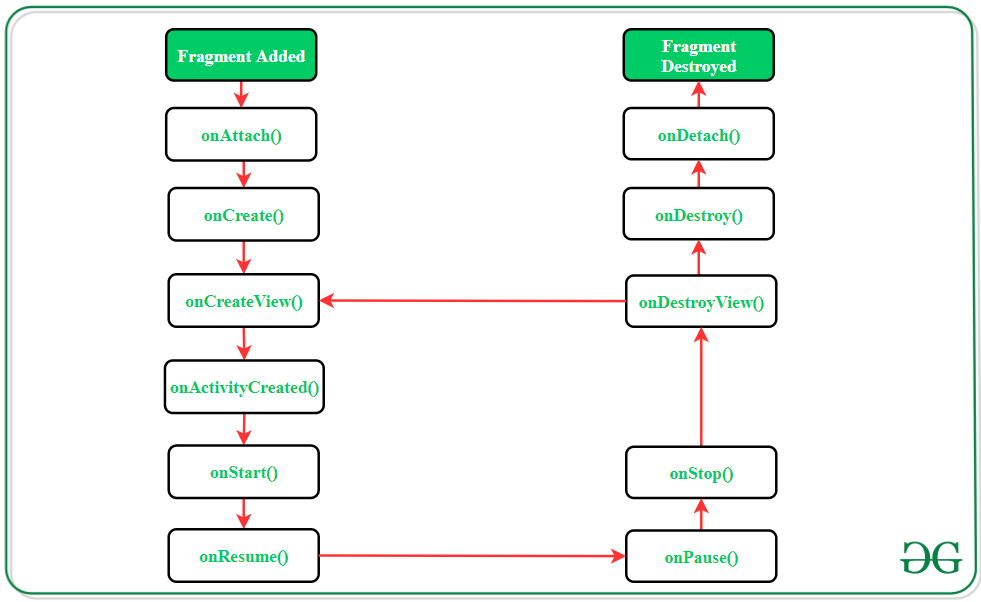

1.  Надувається фрагмент в onCrateView 
    
2.   Створити фрагмент можна графічно натискаючи кнопки меню в Android Studio

*** NOTICE *** 
OnAttach(Contex?) , onCreate(Bundle?), onCreateView(...) та onViewCreated(...) викликаються при додаванні фрагмента у FragmentManager

Запуск Fragment в main activity: 

```kotlin
if (binding.fragmentContainerView == null) { 

    supportFragmentManager 

        .beginTransaction() 

        .add(R.id.fragmentContainerView, MyFragment()) 

        .commit() 

}
```

Запуск Fragment: 
```kotlin
supportFragmentManager.beginTransaction() 
.replace(R.id.place_holder, BlankFragment.newInstance()) 
.commit()
```

Цикл життя фрагментів:


**_onAttach()**_ 
The very first method to be called when the fragment has been associated with the activity. This method executes only once during the lifetime of a fragment.   

**_onCreate()**_ 
This method initializes the fragment by adding all the required attributes and components. 

**_onCreateView()**_  
System calls this method to create the user interface of the fragment. The root of the fragment’s layout is returned as the View component by this method to draw the UI. 

**_onActivityCreated()**_  
It indicates that the activity has been created in which the fragment exists. View hierarchy of the fragment also instantiated before this function call.  

**_onStart()**_  
The system invokes this method to make the fragment visible on the user’s device. 

**_onResume()**_  
This method is called to make the visible fragment interactive. 

**_onPause()**_  
It indicates that the user is leaving the fragment. System call this method to commit the changes made to the fragment.  

**_onStop()**_  
Method to terminate the functioning and visibility of fragment from the user’s screen.  

**_onDestroyView()**_  
System calls this method to clean up all kinds of resources as well as view hierarchy associated with the fragment. 

**_onDestroy()**_  
It is called to perform the final clean up of fragment’s state and its lifecycle. 


***onDetach()**_  
The system executes this method to disassociate the fragment from its host activity.

