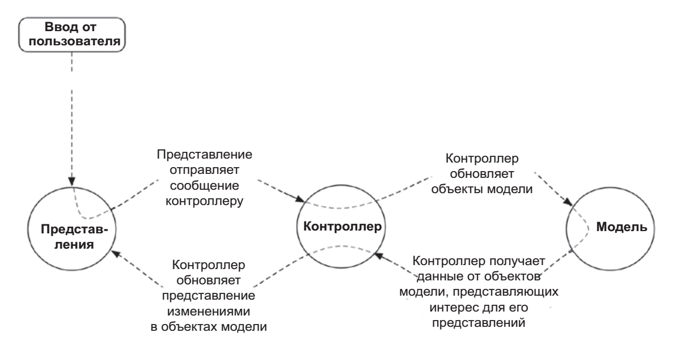

Model - View - Controller 

-   Model - данні та бізнес логіка. Сутності: користувач, продукт, фото на сервері, питання "так,ні" і т.д. Модель - нічого не знає про відображення, вона потрібна для ЗБЕРІГАННЯ та УПРАВЛІННЯ данними 
    
-   View - все що бачимо, все що є на екрані. В андроід - всі віджети в xml 
    
-   Controller - сутність яка поєднує данні та візуалізацію. В андроід: Activity та Fragment

