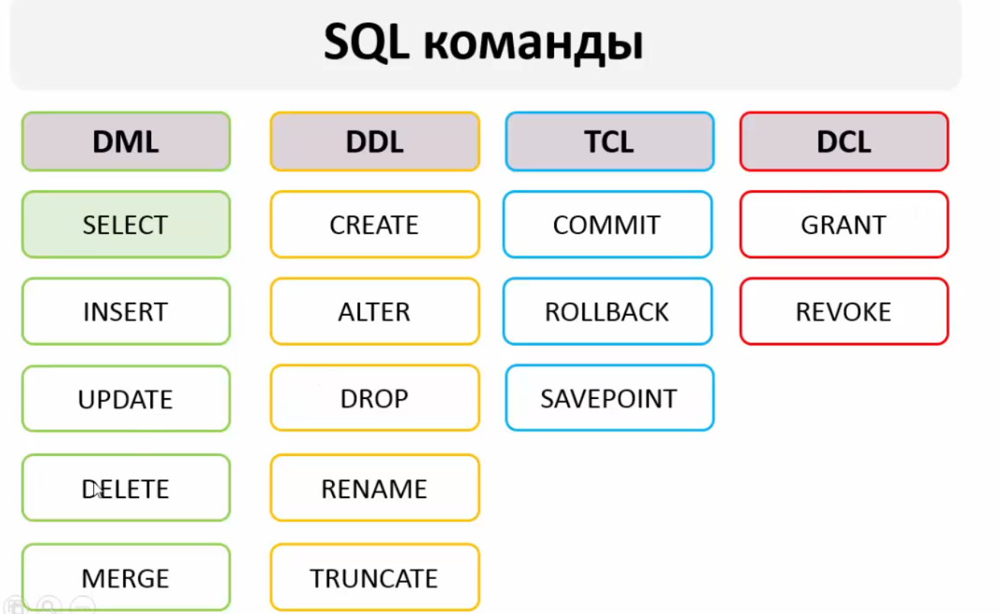

(Data Manipulation Language, Data Definition Language, Transaction Control Language , Data Conrol Language) 

Для навчання на убунту встановив собі sqlite3 та sqlite3 browser: 

sudo apt install sqlite3 

sudo apt install sqlitebrowser 

Для гарного відображення:  

.headers on 
.mode column 

(Це в рамках навчання, для андроіду це робити не треба, а також в SQLite **не** має концепції логін/паароль) 

1) Створити базу даних: 

sqlite3 anyDBName.db